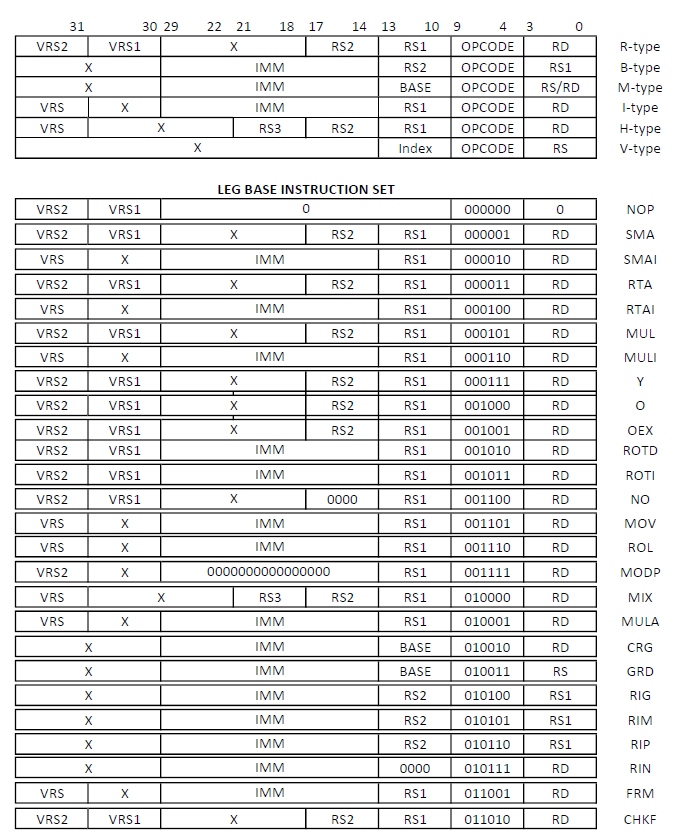

# LEG    <small>REFERENCE DATA CARD

### ARITHMETIC INSTRUCTIONS 

| MNEMONIC, NAME | OP-CODE|  FORMAT | OPERATION 
|---|---|---|---|
| NOP | 000000 | - | no-op 
| SMA - <small>suma | 000001 | R |  rd ← rs1 + rs2 
| SMAI - <small>suma inmediato| 000010 | I |  rd ← rs1 + imm  
| RTA - <small>resta| 000011 | R | rd ← rs1 - rs2 
| RTAI - <small>resta inmediato | 000100 |  I | rd ← rs1 - imm 
| MUL - <small>multiplicación | 000101 |  R |  rd ← rs1 * rs2 
| MULI - <small>multiplicación inmediato | 000110 | I | rd ← rs1 * imm 
| Y - <small>and | 000111 | R | rd ← rs1 & rs2 
| O - <small>or | 001000 |  R | rd ← rs1 \| rs2 
| OEX - <small>xor | 001001 |  R | rd ← rs1 ^ rs2 
| ROTD - <small>rota derecha| 001010 | I |  rd ← rotr64(rs, imm) 
| ROTI - <small>rota izquierda| 001011 |  I | rd ← rotl64(rs, imm) 
| NO - <small>bitwise not| 001100 |  I | rd ← ~rs 
| MOV - <small>mover | 001101 | R | rd ← imm 

### HASH INSTRUCTIONS

| MNEMONIC, NAME | OP-CODE|  FORMAT | OPERATION 
|---|---|---|---|
| ROL - <small> rol64 | 001110 | I |  rd ← (rs1 << imm) or (rs1 >> (64 - imm))
| MODP - <small>modulo primo | 001111 | I | rd ← rs1 mod 0xFFFFFFFB 
| MIX - <small> mix no lineal | 010000 | H |  rd ← (rs1 & rs2) | (~rs1 & rs3)  
| MULA - <small>multiplicacion aurea | 010001 | I | rd ← (rs1 * 0x9e3779b97f4a7c15)  

### MEMORY ACCESS/ DATA HANDLING INSTRUCTIONS

| MNEMONIC, NAME | OP-CODE|  FORMAT | OPERATION 
|---|---|---|---|
| CRG - <small>cargar | 010010 | M |  rd ← M64[base+offs]
| GRD - <small>guardar | 010011 | M | M64[base+offs] ← rs

### BRANCH/JUMP INSTRUCTIONS

| MNEMONIC, NAME | OP-CODE|  FORMAT | OPERATION 
|---|---|---|---|
| RIG - <small>rama igual | 010100 | B |  if(rs1==rs2) pc+=off
| RIM - <small>rama igual o mayor | 010101 | B | if(rs1>=rs2) pc+=off
| RIP - <small>rama igual o más pequeño | 010110 | B |  if(rs1<=rs2) pc+=off 
| RIN - <small>rama incondicional | 010111 | B | rd←pc+4; pc+=off

### VAULT INTERACTION INSTRUCTIONS

| MNEMONIC, NAME | OP-CODE|  FORMAT | OPERATION 
|---|---|---|---|
| GDRH - <small>guardar hash | 010111 | V | rs ← vault_hash_reg[index]
| GDRK - <small>guardar clave | 011000 | V | rs ← vault_key_reg[index]

### AUTHENTICATION INSTRUCTIONS

| MNEMONIC, NAME | OP-CODE|  FORMAT | OPERATION 
|---|---|---|---|
| AUT - <small>autenticación de bóveda | 011011 | A | vault_access ← (password == master_password)

### SIGNATURE INSTRUCTIONS
| MNEMONIC, NAME | OP-CODE|  FORMAT | OPERATION
|---|---|---|---|
| FRM - <small> generar firma | 011001 | I | rd ← (rs ^ KEY)
| CHKF - <small> verificar firma | 011010 | R | rd ← (rs1 == rs2)

### CORE INSTRUCTION FORMATS
|TYPE| 31 |30| 29-22|21-18|17-14|13-10|9-4|3-0|
|---|---|---|---|---|---|---|---|---|
| R | VRS2 |VRS1||X(12) | RS2(4) | RS1(4) | OPC(6) | RD(4)
| B |X|X|||OFFSET(16)  |RS2(4) | OPC(6) | RS1(4)
| M |X|X|||OFFSET(16)  |BASE(4) | OPC(6) | RS/RD(4)
| I | VRS |X|||IMM(16)  |RS(4) | OPC(6) | RD(4)
| H |VRS||X(9) | RS3(4) | RS2(4) | RS1(4) | OPC(6) | RD(4) 
| V |||||X(20)|INDEX(2)|OPC(6)|RS(4)|
| A |X|X|||PASSWORD(16)|X(4)|OPC(6)|X(4)|

V(2): Vault register specifier (00: no vault, 01 for rs1 vault register, 10 for rs2 vault register, 11 for rs1 and rs2 vault register)
A: Authentication type - PASSWORD(16) holds the numeric password (0-65535) for vault authentication

 
### REGISTER NAME, CALLING, USE

| NAME   | CALLING | USE                                              |
|----------| -----|--------------------------------------------------|
| L0       | | Argumento / Valor de retorno / Variable temporal |
| L1-L2    || Argumento / Variable temporal                    |
| L3-L7    | (G0-G4) | Variables preservadas                            |
| L8-L11 |(P0-P3) | Variable temporal                          |
| L12 |(SP) | Puntero a la pila de memoria                     |
| L13 |(LR) | Puntero de link / Dirección de retorno           |
| L14 |(PC) | Contador de programa                             |
| L15 |(Zero) | Número cero     |

### INSTRUCTION ENCODINGS

### ADDITIONAL INFORMATION 

1. LEG utiliza un formato de endianess BIG ENDIAN. 
2. Solo utiliza datos sin signo a excepción de instrucciones de saltos condicionales.
3. No tiene instrucciones de punto flotante, ni de llamada a subrutinas o funciones. 
4. Tamaño de inmediatos: 16 bits

